# AthliFi Development Phases - Detailed Roadmap

```mermaid
flowchart TD
    START["🚀 <b>AthliFi Project Start</b>"]
    
    %% ========== FAZ 1 ==========
    START --> FAZ1_START
    
    subgraph FAZ1["<b>FAZ 1: TEMEL ON-CHAIN LINKTREE</b> ✅ TAMAMLANDI"]
        FAZ1_START["<b>Başlangıç</b>"]
        
        FAZ1_MOVE["<b>🔷 Smart Contract (Move)</b><br/>━━━━━━━━━━━━━━<br/>✓ about::create<br/>✓ registry::register<br/>✓ list::add_link<br/>✓ nft_list::add_nft<br/>✓ Dynamic Fields (username → ID)"]
        
        FAZ1_UI["<b>🎨 Frontend (React)</b><br/>━━━━━━━━━━━━━━<br/>✓ Wallet connection (dApp Kit)<br/>✓ AthleteProfileForm<br/>✓ SocialLinksManager<br/>✓ NFTGalleryManager<br/>✓ ProfileView (search)<br/>✓ Tab navigation"]
        
        FAZ1_HOOKS["<b>🪝 Custom Hooks</b><br/>━━━━━━━━━━━━━━<br/>✓ useEnokiSponsoredTransaction<br/>✓ useProfileData<br/>✓ useSponsoredTransaction"]
        
        FAZ1_DEPLOY["<b>📦 Deployment</b><br/>━━━━━━━━━━━━━━<br/>✓ Local dev server<br/>✓ Testnet contracts<br/>✓ Enoki sponsor aktif"]
        
        FAZ1_START --> FAZ1_MOVE
        FAZ1_MOVE --> FAZ1_UI
        FAZ1_UI --> FAZ1_HOOKS
        FAZ1_HOOKS --> FAZ1_DEPLOY
    end
    
    FAZ1_DEPLOY --> FAZ2_START
    
    %% ========== FAZ 2 ==========
    subgraph FAZ2["<b>FAZ 2: DİNAMİK ROUTING + WALRUS SITES</b> 🎯 ŞİMDİ"]
        FAZ2_START["<b>Başlangıç</b>"]
        
        FAZ2_ROUTER["<b>🛣️ React Router</b><br/>━━━━━━━━━━━━━━<br/>⚡ Routes yapısı:<br/>• / → Ana sayfa<br/>• /:username → Profil<br/>• /create → Oluştur<br/>• /dashboard → Panel<br/><br/>⚡ useParams hook<br/>⚡ Navigate komponenti"]
        
        FAZ2_PAGES["<b>📄 Yeni Sayfalar</b><br/>━━━━━━━━━━━━━━<br/>⚡ HomePage.tsx<br/>⚡ ProfilePage.tsx (dynamic)<br/>⚡ CreatePage.tsx<br/>⚡ DashboardPage.tsx<br/>⚡ NotFoundPage.tsx"]
        
        FAZ2_WALRUS["<b>🐋 Walrus Integration</b><br/>━━━━━━━━━━━━━━<br/>⚡ Build optimizasyonu<br/>⚡ ws-resources.json<br/>⚡ site-builder kurulum<br/>⚡ Deploy script<br/>⚡ B36 ID testi"]
        
        FAZ2_SUINS["<b>🌐 SuiNS Domain</b><br/>━━━━━━━━━━━━━━<br/>⚡ .sui domain al<br/>⚡ Site objesine yönlendir<br/>⚡ DNS propagation<br/>⚡ trwal.app konfigürasyonu"]
        
        FAZ2_MOVE["<b>🔷 Contract Updates</b><br/>━━━━━━━━━━━━━━<br/>⚡ Profile metadata++<br/>⚡ Public/private fields<br/>⚡ Profile settings struct"]
        
        FAZ2_START --> FAZ2_ROUTER
        FAZ2_ROUTER --> FAZ2_PAGES
        FAZ2_PAGES --> FAZ2_WALRUS
        FAZ2_WALRUS --> FAZ2_SUINS
        FAZ2_SUINS --> FAZ2_MOVE
    end
    
    FAZ2_MOVE --> FAZ3_START
    
    %% ========== FAZ 3 ==========
    subgraph FAZ3["<b>FAZ 3: BAĞIŞ SİSTEMİ</b> 💰"]
        FAZ3_START["<b>Başlangıç</b>"]
        
        FAZ3_MOVE["<b>🔷 Donation Module</b><br/>━━━━━━━━━━━━━━<br/>⚡ donation::send_donation<br/>⚡ profile::set_threshold<br/>⚡ donation::get_history<br/>⚡ donation::get_top_supporters<br/><br/>struct DonationEvent:<br/>• donor: address<br/>• amount: u64<br/>• timestamp: u64<br/>• message: String"]
        
        FAZ3_UI["<b>🎨 UI Components</b><br/>━━━━━━━━━━━━━━<br/>⚡ DonationWidget.tsx<br/>⚡ DonationHistory.tsx<br/>⚡ TopSupporters.tsx<br/>⚡ ThankYouModal.tsx<br/>⚡ DonationSettings.tsx"]
        
        FAZ3_PTB["<b>⚙️ PTB Integration</b><br/>━━━━━━━━━━━━━━<br/>⚡ Coin transfer logic<br/>⚡ Multi-step transactions<br/>⚡ Gas estimation<br/>⚡ Success notification"]
        
        FAZ3_HOOKS["<b>🪝 New Hooks</b><br/>━━━━━━━━━━━━━━<br/>⚡ useDonation<br/>⚡ useDonationHistory<br/>⚡ useTopSupporters"]
        
        FAZ3_START --> FAZ3_MOVE
        FAZ3_MOVE --> FAZ3_UI
        FAZ3_UI --> FAZ3_PTB
        FAZ3_PTB --> FAZ3_HOOKS
    end
    
    FAZ3_HOOKS --> FAZ4_START
    
    %% ========== FAZ 4 ==========
    subgraph FAZ4["<b>FAZ 4: NFT-GATED EXCLUSIVE CONTENT</b> 🎫"]
        FAZ4_START["<b>Başlangıç</b>"]
        
        FAZ4_MOVE["<b>🔷 Supporter Pass Module</b><br/>━━━━━━━━━━━━━━<br/>⚡ supporter_pass::mint<br/>⚡ supporter_pass::verify<br/>⚡ supporter_pass::get_holders<br/>⚡ profile::add_exclusive_link<br/><br/>struct SupporterPassNFT:<br/>• athlete_profile: ID<br/>• supporter: address<br/>• tier: u8 (Bronze/Silver/Gold)<br/>• mint_date: u64<br/>• benefits: vector&lt;String&gt;"]
        
        FAZ4_PROFILE["<b>📝 Profile Updates</b><br/>━━━━━━━━━━━━━━<br/>⚡ exclusive_links: vector<br/>⚡ pass_price: u64<br/>⚡ pass_max_supply: u64<br/>⚡ pass_minted: u64<br/>⚡ tier_prices: vector<br/>⚡ pass_holders: Table"]
        
        FAZ4_UI["<b>🎨 NFT Components</b><br/>━━━━━━━━━━━━━━<br/>⚡ MintPassWidget.tsx<br/>⚡ ExclusiveContent.tsx<br/>⚡ PassVerification.tsx<br/>⚡ SupporterDashboard.tsx<br/>⚡ PassSettings.tsx<br/>⚡ TierSelector.tsx"]
        
        FAZ4_LOGIC["<b>🔐 Access Control</b><br/>━━━━━━━━━━━━━━<br/>⚡ Real-time NFT check<br/>⚡ Wallet ownership verify<br/>⚡ Content gating logic<br/>⚡ Tier-based access<br/>⚡ Cache optimization"]
        
        FAZ4_HOOKS["<b>🪝 NFT Hooks</b><br/>━━━━━━━━━━━━━━<br/>⚡ useNFTOwnership<br/>⚡ useMintPass<br/>⚡ useExclusiveContent<br/>⚡ useSupporterDashboard"]
        
        FAZ4_START --> FAZ4_MOVE
        FAZ4_MOVE --> FAZ4_PROFILE
        FAZ4_PROFILE --> FAZ4_UI
        FAZ4_UI --> FAZ4_LOGIC
        FAZ4_LOGIC --> FAZ4_HOOKS
    end
    
    FAZ4_HOOKS --> FAZ5_START
    
    %% ========== FAZ 5 ==========
    subgraph FAZ5["<b>FAZ 5: INNER CIRCLE DAO</b> 🗳️"]
        FAZ5_START["<b>Başlangıç</b>"]
        
        FAZ5_MOVE["<b>🔷 DAO Module</b><br/>━━━━━━━━━━━━━━<br/>⚡ dao::create_proposal<br/>⚡ dao::vote<br/>⚡ dao::execute_proposal<br/>⚡ dao::get_results<br/><br/>struct Proposal:<br/>• id: UID<br/>• creator: address<br/>• title: String<br/>• description: String<br/>• voting_power: Table<br/>• deadline: u64<br/>• status: u8"]
        
        FAZ5_VOTING["<b>🗳️ Voting System</b><br/>━━━━━━━━━━━━━━<br/>⚡ Weighted voting (NFT tier)<br/>⚡ Quadratic voting option<br/>⚡ Proposal threshold<br/>⚡ Quorum mechanism<br/>⚡ Time-lock execution"]
        
        FAZ5_UI["<b>🎨 DAO Components</b><br/>━━━━━━━━━━━━━━<br/>⚡ ProposalList.tsx<br/>⚡ CreateProposal.tsx<br/>⚡ VoteWidget.tsx<br/>⚡ ProposalDetails.tsx<br/>⚡ DAOStats.tsx<br/>⚡ GovernanceDashboard.tsx"]
        
        FAZ5_FEATURES["<b>✨ Extra Features</b><br/>━━━━━━━━━━━━━━<br/>⚡ Community polls<br/>⚡ Milestone tracking<br/>⚡ Treasury management<br/>⚡ Reward distribution<br/>⚡ Event scheduling"]
        
        FAZ5_START --> FAZ5_MOVE
        FAZ5_MOVE --> FAZ5_VOTING
        FAZ5_VOTING --> FAZ5_UI
        FAZ5_UI --> FAZ5_FEATURES
    end
    
    FAZ5_FEATURES --> FAZ6_START
    
    %% ========== FAZ 6 ==========
    subgraph FAZ6["<b>FAZ 6: ADVANCED FEATURES</b> 🚀"]
        FAZ6_START["<b>Başlangıç</b>"]
        
        FAZ6_TEAMS["<b>🏆 Team Profiles</b><br/>━━━━━━━━━━━━━━<br/>⚡ Team/Club strukture<br/>⚡ Multi-athlete profiles<br/>⚡ Shared treasury<br/>⚡ Team NFT collections<br/>⚡ Roster management"]
        
        FAZ6_ANALYTICS["<b>📊 Analytics</b><br/>━━━━━━━━━━━━━━<br/>⚡ On-chain data viz<br/>⚡ Supporter insights<br/>⚡ Revenue tracking<br/>⚡ Engagement metrics<br/>⚡ Export reports"]
        
        FAZ6_LIVE["<b>🎮 Live Events</b><br/>━━━━━━━━━━━━━━<br/>⚡ Real-time minting<br/>⚡ Event NFTs<br/>⚡ Live streaming integration<br/>⚡ Chat/commentary<br/>⚡ Momento drops"]
        
        FAZ6_MOBILE["<b>📱 Mobile App</b><br/>━━━━━━━━━━━━━━<br/>⚡ React Native<br/>⚡ Push notifications<br/>⚡ Mobile wallet<br/>⚡ QR code scanning<br/>⚡ Offline mode"]
        
        FAZ6_MULTICHAIN["<b>🌐 Multi-Chain</b><br/>━━━━━━━━━━━━━━<br/>⚡ Cross-chain bridge<br/>⚡ EVM compatibility<br/>⚡ Multi-wallet support<br/>⚡ Asset portability"]
        
        FAZ6_MESSAGING["<b>💬 Messaging</b><br/>━━━━━━━━━━━━━━<br/>⚡ E2E encryption<br/>⚡ Supporter DMs<br/>⚡ Group chats<br/>⚡ NFT-gated channels"]
        
        FAZ6_START --> FAZ6_TEAMS
        FAZ6_START --> FAZ6_ANALYTICS
        FAZ6_START --> FAZ6_LIVE
        FAZ6_START --> FAZ6_MOBILE
        FAZ6_START --> FAZ6_MULTICHAIN
        FAZ6_START --> FAZ6_MESSAGING
    end
    
    FAZ6_TEAMS --> END
    FAZ6_ANALYTICS --> END
    FAZ6_LIVE --> END
    FAZ6_MOBILE --> END
    FAZ6_MULTICHAIN --> END
    FAZ6_MESSAGING --> END
    
    END["🎯 <b>AthliFi Platform Complete</b>"]
    
    %% Styling
    style FAZ1 fill:#90EE90,stroke:#2E7D32,stroke-width:3px
    style FAZ2 fill:#FFD700,stroke:#F57F17,stroke-width:3px
    style FAZ3 fill:#87CEEB,stroke:#0277BD,stroke-width:3px
    style FAZ4 fill:#DDA0DD,stroke:#7B1FA2,stroke-width:3px
    style FAZ5 fill:#FFA07A,stroke:#E64A19,stroke-width:3px
    style FAZ6 fill:#D3D3D3,stroke:#424242,stroke-width:3px
    
    style START fill:#4CAF50,stroke:#1B5E20,stroke-width:4px,color:#fff
    style END fill:#FF5722,stroke:#BF360C,stroke-width:4px,color:#fff
```



---

## 📋 Phase Summary

### ✅ **FAZ 1: TEMEL ON-CHAIN LINKTREE** (TAMAMLANDI)
**Duration:** 1-2 hafta  
**Status:** ✅ Complete  
**Key Deliverables:**
- Basic profile creation and management
- Social links & NFT gallery
- Username-based search
- Gas-free transactions (Enoki)
- Local development environment

---

### 🎯 **FAZ 2: DİNAMİK ROUTING + WALRUS SITES** (ŞİMDİ)
**Duration:** 1 hafta  
**Status:** 🔄 Next Up  
**Key Deliverables:**
- React Router implementation
- Dynamic profile URLs (`/:username`)
- Walrus Sites deployment
- SuiNS domain integration
- Production-ready build

**Technical Tasks:**
```bash
# 1. Install dependencies
pnpm add react-router-dom

# 2. Create routing structure
# 3. Build & optimize for Walrus
pnpm build

# 4. Deploy to Walrus
site-builder deploy ./dist --epochs 1

# 5. Configure SuiNS
# Buy .sui domain & point to site object
```

---

### 💰 **FAZ 3: BAĞIŞ SİSTEMİ**
**Duration:** 1 hafta  
**Status:** 📅 Planned  
**Key Deliverables:**
- Donation widget on profiles
- PTB-based SUI transfers
- Donation history & leaderboard
- Minimum threshold settings
- Thank you notifications

---

### 🎫 **FAZ 4: NFT-GATED EXCLUSIVE CONTENT**
**Duration:** 2 hafta  
**Status:** 📅 Planned  
**Key Deliverables:**
- Supporter Pass NFT minting
- Tier system (Bronze/Silver/Gold)
- Exclusive content for NFT holders
- Real-time ownership verification
- Supporter dashboard

---

### 🗳️ **FAZ 5: INNER CIRCLE DAO**
**Duration:** 2 hafta  
**Status:** 📅 Future  
**Key Deliverables:**
- Governance proposals
- Weighted voting system
- Community polls
- Treasury management
- Milestone tracking

---

### 🚀 **FAZ 6: ADVANCED FEATURES**
**Duration:** 4+ hafta  
**Status:** 📅 Future  
**Key Deliverables:**
- Team/Club profiles
- Analytics dashboard
- Mobile app (React Native)
- Multi-chain support
- Live event features
- Encrypted messaging

---

## 🎯 Current Focus: FAZ 2

**Next Steps:**
1. ✅ React Router setup
2. ✅ Create routing pages
3. ✅ Walrus Sites configuration
4. ✅ SuiNS domain integration
5. ✅ Production deployment

**Success Metrics:**
- ✅ Direct URL access works (`trwal.app/usain-bolt`)
- ✅ Site loads from Walrus
- ✅ SuiNS domain resolves correctly
- ✅ All features from Faz 1 work in production

---

## 📊 Development Timeline

```
Faz 1: ████████████████████ 100% (DONE)
Faz 2: ░░░░░░░░░░░░░░░░░░░░   0% (NEXT)
Faz 3: ░░░░░░░░░░░░░░░░░░░░   0%
Faz 4: ░░░░░░░░░░░░░░░░░░░░   0%
Faz 5: ░░░░░░░░░░░░░░░░░░░░   0%
Faz 6: ░░░░░░░░░░░░░░░░░░░░   0%
```

**Total Estimated Time:** 11-13 hafta  
**Current Phase:** Faz 2 (Week 3)

