# AthliFi Development Phases - Detailed Roadmap

```mermaid
flowchart TD
    START["🚀 <b>AthliFi Project Start</b>"]
    
    %% ========== FAZ 1 ==========
    START --> FAZ1_START
    
    subgraph FAZ1["<b>FAZ 1: TEMEL ON-CHAIN LINKTREE</b> ✅ TAMAMLANDI"]
        FAZ1_START["<b>Başlangıç</b>"]
        
        FAZ1_MOVE["<b>🔷 Smart Contract (Move)</b><br/>━━━━━━━━━━━━━━<br/>✓ about::create<br/>✓ registry::register<br/>✓ list::add_link<br/>✓ nft_list::add_nft<br/>✓ Dynamic Fields (username → ID)"]
        
        FAZ1_UI["<b>🎨 Frontend (React)</b><br/>━━━━━━━━━━━━━━<br/>✓ Wallet connection (dApp Kit)<br/>✓ AthleteProfileForm<br/>✓ SocialLinksManager<br/>✓ NFTGalleryManager<br/>✓ ProfileView (search)<br/>✓ Tab navigation"]
        
        FAZ1_HOOKS["<b>🪝 Custom Hooks</b><br/>━━━━━━━━━━━━━━<br/>✓ useEnokiSponsoredTransaction<br/>✓ useProfileData<br/>✓ useSponsoredTransaction"]
        
        FAZ1_DEPLOY["<b>📦 Deployment</b><br/>━━━━━━━━━━━━━━<br/>✓ Local dev server<br/>✓ Testnet contracts<br/>✓ Enoki sponsor aktif"]
        
        FAZ1_START --> FAZ1_MOVE
        FAZ1_MOVE --> FAZ1_UI
        FAZ1_UI --> FAZ1_HOOKS
        FAZ1_HOOKS --> FAZ1_DEPLOY
    end
    
    FAZ1_DEPLOY --> FAZ2_START
    
    %% ========== FAZ 2 ==========
    subgraph FAZ2["<b>FAZ 2: DİNAMİK ROUTING + WALRUS SITES</b> ✅ TAMAMLANDI"]
        FAZ2_START["<b>Başlangıç</b>"]
        
        FAZ2_ROUTER["<b>🛣️ React Router</b><br/>━━━━━━━━━━━━━━<br/>⚡ Routes yapısı:<br/>• / → Ana sayfa<br/>• /:username → Profil<br/>• /create → Oluştur<br/>• /dashboard → Panel<br/><br/>⚡ useParams hook<br/>⚡ Navigate komponenti"]
        
        FAZ2_PAGES["<b>📄 Yeni Sayfalar</b><br/>━━━━━━━━━━━━━━<br/>⚡ HomePage.tsx<br/>⚡ ProfilePage.tsx (dynamic)<br/>⚡ CreatePage.tsx<br/>⚡ DashboardPage.tsx<br/>⚡ NotFoundPage.tsx"]
        
        FAZ2_WALRUS["<b>🐋 Walrus Integration</b><br/>━━━━━━━━━━━━━━<br/>⚡ Build optimizasyonu<br/>⚡ ws-resources.json<br/>⚡ site-builder kurulum<br/>⚡ Deploy script<br/>⚡ B36 ID testi"]
        
        FAZ2_SUINS["<b>🌐 SuiNS Domain</b><br/>━━━━━━━━━━━━━━<br/>⚡ .sui domain al<br/>⚡ Site objesine yönlendir<br/>⚡ DNS propagation<br/>⚡ trwal.app konfigürasyonu"]
        
        FAZ2_MOVE["<b>🔷 Contract Updates</b><br/>━━━━━━━━━━━━━━<br/>⚡ Profile metadata++<br/>⚡ Public/private fields<br/>⚡ Profile settings struct"]
        
        FAZ2_START --> FAZ2_ROUTER
        FAZ2_ROUTER --> FAZ2_PAGES
        FAZ2_PAGES --> FAZ2_WALRUS
        FAZ2_WALRUS --> FAZ2_SUINS
        FAZ2_SUINS --> FAZ2_MOVE
    end
    
    FAZ2_MOVE --> FAZ3_START
    
    %% ========== FAZ 3 ==========
    subgraph FAZ3["<b>FAZ 3: BAĞIŞ SİSTEMİ</b> ✅ TAMAMLANDI"]
        FAZ3_START["<b>Başlangıç</b>"]
        
        FAZ3_MOVE["<b>🔷 Donation Module</b><br/>━━━━━━━━━━━━━━<br/>⚡ donation::send_donation<br/>⚡ profile::set_threshold<br/>⚡ donation::get_history<br/>⚡ donation::get_top_supporters<br/><br/>struct DonationEvent:<br/>• donor: address<br/>• amount: u64<br/>• timestamp: u64<br/>• message: String"]
        
        FAZ3_UI["<b>🎨 UI Components</b><br/>━━━━━━━━━━━━━━<br/>⚡ DonationWidget.tsx<br/>⚡ DonationHistory.tsx<br/>⚡ TopSupporters.tsx<br/>⚡ ThankYouModal.tsx<br/>⚡ DonationSettings.tsx"]
        
        FAZ3_PTB["<b>⚙️ PTB Integration</b><br/>━━━━━━━━━━━━━━<br/>⚡ Coin transfer logic<br/>⚡ Multi-step transactions<br/>⚡ Gas estimation<br/>⚡ Success notification"]
        
        FAZ3_HOOKS["<b>🪝 New Hooks</b><br/>━━━━━━━━━━━━━━<br/>⚡ useDonation<br/>⚡ useDonationHistory<br/>⚡ useTopSupporters"]
        
        FAZ3_START --> FAZ3_MOVE
        FAZ3_MOVE --> FAZ3_UI
        FAZ3_UI --> FAZ3_PTB
        FAZ3_PTB --> FAZ3_HOOKS
    end
    
    FAZ3_HOOKS --> FAZ4_START
    
    %% ========== FAZ 4 ==========
    subgraph FAZ4["<b>FAZ 4: NFT-GATED EXCLUSIVE CONTENT</b> 🎯 ŞİMDİ"]
        FAZ4_START["<b>Başlangıç</b>"]
        
        FAZ4_MOVE["<b>🔷 Supporter Pass Module</b><br/>━━━━━━━━━━━━━━<br/>⚡ supporter_pass::mint<br/>⚡ supporter_pass::verify<br/>⚡ supporter_pass::get_holders<br/>⚡ profile::add_exclusive_link<br/><br/>struct SupporterPassNFT:<br/>• athlete_profile: ID<br/>• supporter: address<br/>• tier: u8 (Bronze/Silver/Gold)<br/>• mint_date: u64<br/>• benefits: vector&lt;String&gt;"]
        
        FAZ4_PROFILE["<b>📝 Profile Updates</b><br/>━━━━━━━━━━━━━━<br/>⚡ exclusive_links: vector<br/>⚡ pass_price: u64<br/>⚡ pass_minted: u64 (unlimited)<br/>⚡ tier_prices: vector<br/>⚡ pass_holders: Table<br/>⚡ ∞ NO max_supply limit"]
        
        FAZ4_UI["<b>🎨 NFT Components</b><br/>━━━━━━━━━━━━━━<br/>⚡ MintPassWidget.tsx<br/>⚡ ExclusiveContent.tsx<br/>⚡ PassVerification.tsx<br/>⚡ SupporterDashboard.tsx<br/>⚡ PassSettings.tsx<br/>⚡ TierSelector.tsx"]
        
        FAZ4_LOGIC["<b>🔐 Access Control</b><br/>━━━━━━━━━━━━━━<br/>⚡ Real-time NFT check<br/>⚡ Wallet ownership verify<br/>⚡ Content gating logic<br/>⚡ Tier-based access<br/>⚡ Cache optimization"]
        
        FAZ4_HOOKS["<b>🪝 NFT Hooks</b><br/>━━━━━━━━━━━━━━<br/>⚡ useNFTOwnership<br/>⚡ useMintPass<br/>⚡ useExclusiveContent<br/>⚡ useSupporterDashboard"]
        
        FAZ4_START --> FAZ4_MOVE
        FAZ4_MOVE --> FAZ4_PROFILE
        FAZ4_PROFILE --> FAZ4_UI
        FAZ4_UI --> FAZ4_LOGIC
        FAZ4_LOGIC --> FAZ4_HOOKS
    end
    
    FAZ4_HOOKS --> FAZ5_START
    
    %% ========== FAZ 5 ==========
    subgraph FAZ5["<b>FAZ 5: GLASS MORPHISM & ANIMATIONS</b> ✨"]
        FAZ5_START["<b>Başlangıç</b>"]
        
        FAZ5_DESIGN["<b>🎨 Glass Morphism Design System</b><br/>━━━━━━━━━━━━━━<br/>⚡ Frosted glass components<br/>⚡ Backdrop blur effects<br/>⚡ Semi-transparent layers<br/>⚡ Border gradients<br/>⚡ Depth layering"]
        
        FAZ5_COMPONENTS["<b>🔧 UI Components</b><br/>━━━━━━━━━━━━━━<br/>⚡ GlassCard.tsx<br/>⚡ GlassModal.tsx<br/>⚡ GlassButton.tsx<br/>⚡ GlassInput.tsx<br/>⚡ GlassPanel.tsx<br/>⚡ GlassTooltip.tsx"]
        
        FAZ5_ANIMATIONS["<b>⚙️ Animation Library</b><br/>━━━━━━━━━━━━━━<br/>⚡ Framer Motion integration<br/>⚡ Page transitions<br/>⚡ Component entrance/exit<br/>⚡ Scroll-based animations<br/>⚡ Micro-interactions"]
        
        FAZ5_EFFECTS["<b>✨ Visual Effects</b><br/>━━━━━━━━━━━━━━<br/>⚡ Particle effects<br/>⚡ Gradient animations<br/>⚡ Hover states<br/>⚡ Loading animations<br/>⚡ Success/error states"]
        
        FAZ5_TOKENS["<b>🎯 Design Tokens</b><br/>━━━━━━━━━━━━━━<br/>⚡ Glass color schemes<br/>⚡ Animation timings<br/>⚡ Easing functions<br/>⚡ Opacity variations<br/>⚡ Blur values"]
        
        FAZ5_START --> FAZ5_DESIGN
        FAZ5_DESIGN --> FAZ5_COMPONENTS
        FAZ5_COMPONENTS --> FAZ5_ANIMATIONS
        FAZ5_ANIMATIONS --> FAZ5_EFFECTS
        FAZ5_EFFECTS --> FAZ5_TOKENS
    end
    
    FAZ5_TOKENS --> FAZ6_START
    
    %% ========== FAZ 6 ==========
    subgraph FAZ6["<b>FAZ 6: INNER CIRCLE DAO</b> 🗳️"]
        FAZ6_START["<b>Başlangıç</b>"]
        
        FAZ6_MOVE["<b>🔷 DAO Module</b><br/>━━━━━━━━━━━━━━<br/>⚡ dao::create_proposal<br/>⚡ dao::vote<br/>⚡ dao::execute_proposal<br/>⚡ dao::get_results<br/><br/>struct Proposal:<br/>• id: UID<br/>• creator: address<br/>• title: String<br/>• description: String<br/>• voting_power: Table<br/>• deadline: u64<br/>• status: u8"]
        
        FAZ6_VOTING["<b>🗳️ Voting System</b><br/>━━━━━━━━━━━━━━<br/>⚡ Weighted voting (NFT tier)<br/>⚡ Quadratic voting option<br/>⚡ Proposal threshold<br/>⚡ Quorum mechanism<br/>⚡ Time-lock execution"]
        
        FAZ6_UI["<b>🎨 DAO Components</b><br/>━━━━━━━━━━━━━━<br/>⚡ ProposalList.tsx<br/>⚡ CreateProposal.tsx<br/>⚡ VoteWidget.tsx<br/>⚡ ProposalDetails.tsx<br/>⚡ DAOStats.tsx<br/>⚡ GovernanceDashboard.tsx"]
        
        FAZ6_FEATURES["<b>✨ Extra Features</b><br/>━━━━━━━━━━━━━━<br/>⚡ Community polls<br/>⚡ Milestone tracking<br/>⚡ Treasury management<br/>⚡ Reward distribution<br/>⚡ Event scheduling"]
        
        FAZ6_START --> FAZ6_MOVE
        FAZ6_MOVE --> FAZ6_VOTING
        FAZ6_VOTING --> FAZ6_UI
        FAZ6_UI --> FAZ6_FEATURES
    end
    
    FAZ6_FEATURES --> FAZ7_START
    
    %% ========== FAZ 7 ==========
    subgraph FAZ7["<b>FAZ 7: ADVANCED FEATURES</b> 🚀"]
        FAZ7_START["<b>Başlangıç</b>"]
        
        FAZ7_TEAMS["<b>🏆 Team Profiles</b><br/>━━━━━━━━━━━━━━<br/>⚡ Team/Club strukture<br/>⚡ Multi-athlete profiles<br/>⚡ Shared treasury<br/>⚡ Team NFT collections<br/>⚡ Roster management"]
        
        FAZ7_ANALYTICS["<b>📊 Analytics</b><br/>━━━━━━━━━━━━━━<br/>⚡ On-chain data viz<br/>⚡ Supporter insights<br/>⚡ Revenue tracking<br/>⚡ Engagement metrics<br/>⚡ Export reports"]
        
        FAZ7_LIVE["<b>🎮 Live Events</b><br/>━━━━━━━━━━━━━━<br/>⚡ Real-time minting<br/>⚡ Event NFTs<br/>⚡ Live streaming integration<br/>⚡ Chat/commentary<br/>⚡ Momento drops"]
        
        FAZ7_MOBILE["<b>📱 Mobile App</b><br/>━━━━━━━━━━━━━━<br/>⚡ React Native<br/>⚡ Push notifications<br/>⚡ Mobile wallet<br/>⚡ QR code scanning<br/>⚡ Offline mode"]
        
        FAZ7_MULTICHAIN["<b>🌐 Multi-Chain</b><br/>━━━━━━━━━━━━━━<br/>⚡ Cross-chain bridge<br/>⚡ EVM compatibility<br/>⚡ Multi-wallet support<br/>⚡ Asset portability"]
        
        FAZ7_MESSAGING["<b>💬 Messaging</b><br/>━━━━━━━━━━━━━━<br/>⚡ E2E encryption<br/>⚡ Supporter DMs<br/>⚡ Group chats<br/>⚡ NFT-gated channels"]
        
        FAZ7_START --> FAZ7_TEAMS
        FAZ7_START --> FAZ7_ANALYTICS
        FAZ7_START --> FAZ7_LIVE
        FAZ7_START --> FAZ7_MOBILE
        FAZ7_START --> FAZ7_MULTICHAIN
        FAZ7_START --> FAZ7_MESSAGING
    end
    
    FAZ6_FEATURES --> END
    FAZ7_TEAMS --> END
    FAZ7_ANALYTICS --> END
    FAZ7_LIVE --> END
    FAZ7_MOBILE --> END
    FAZ7_MULTICHAIN --> END
    FAZ7_MESSAGING --> END
    
    %% Styling
    style FAZ1 fill:#90EE90,stroke:#2E7D32,stroke-width:3px
    style FAZ2 fill:#90EE90,stroke:#2E7D32,stroke-width:3px
    style FAZ3 fill:#90EE90,stroke:#2E7D32,stroke-width:3px
    style FAZ4 fill:#FFD700,stroke:#F57F17,stroke-width:3px
    style FAZ5 fill:#E6E6FA,stroke:#9370DB,stroke-width:3px
    style FAZ6 fill:#FFA07A,stroke:#E64A19,stroke-width:3px
    style FAZ7 fill:#D3D3D3,stroke:#424242,stroke-width:3px
    
    style START fill:#4CAF50,stroke:#1B5E20,stroke-width:4px,color:#fff
    style END fill:#FF5722,stroke:#BF360C,stroke-width:4px,color:#fff
```



---

## 📋 Phase Summary

### ✅ **FAZ 1: TEMEL ON-CHAIN LINKTREE** (TAMAMLANDI)
**Duration:** 1-2 hafta  
**Status:** ✅ Complete  
**Key Deliverables:**
- Basic profile creation and management
- Social links & NFT gallery
- Username-based search
- Gas-free transactions (Enoki)
- Local development environment

---

### ✅ **FAZ 2: DİNAMİK ROUTING + WALRUS SITES** (TAMAMLANDI)
**Duration:** 1 hafta  
**Status:** ✅ Complete  
**Key Deliverables:**
- ✅ React Router implementation
- ✅ Dynamic profile URLs (`/:username`)
- ✅ **Walrus Sites deployment** (DEPLOYED!)
- ✅ SuiNS domain integration
- ✅ Production-ready build

**Technical Tasks:**
```bash
# 1. Install dependencies
pnpm add react-router-dom

# 2. Create routing structure
# 3. Build & optimize for Walrus
pnpm build

# 4. Deploy to Walrus
site-builder deploy ./dist --epochs 1

# 5. Configure SuiNS
# Buy .sui domain & point to site object
```

---

### ✅ **FAZ 3: BAĞIŞ SİSTEMİ** (TAMAMLANDI)
**Duration:** 1 hafta  
**Status:** ✅ Complete  
**Key Deliverables:**
- ✅ Donation widget on profiles
- ✅ PTB-based SUI transfers
- ✅ Donation history tracking via blockchain queries
- ✅ Top supporters leaderboard
- ✅ Thank you modal notifications
- ✅ Real-time transaction history display

---

---

## 🏁 HACKATHON SPRINT (ŞİMDİ - 10 SAAT)

---

## ⚠️ KNOWN ISSUES - Mevcut Güvenlik Açıkları ve Eksikler

### 🚨 KRİTİK GÜVENLİK SORUNLARI:

**1. Ownership Kontrolü YOK**
- ❌ **Sorun:** `list::add_link` ve `nft_list::add_nft` fonksiyonları sadece username parametresi alıyor
- ❌ **Risk:** Herhangi bir kullanıcı, başkasının username'ini yazıp o profilin linklerini/NFT'lerini manipüle edebilir
- ❌ **Örnek Saldırı:** Ben "lebron" yazıp LeBron'un profiline spam link ekleyebilirim
- ✅ **Çözüm (FAZ 4):** Frontend'de About objesi ownership kontrolü ekle

**2. About Objesi Güncellenemiyor**
- ❌ **Sorun:** `about.move`'da sadece `create` fonksiyonu var, `update` yok
- ❌ **Risk:** Kullanıcı bir kez profil oluşturduktan sonra bio/name değiştiremez
- ✅ **Çözüm (FAZ 4):** Frontend'de yeni About objesi oluşturarak workaround (ya da post-hackathon kontrat update)

**3. Registry'de Owner Bilgisi Yok**
- ❌ **Sorun:** Registry sadece `username -> about_object_id` tutuyor, ama username'in kime ait olduğunu kaydetmiyor
- ❌ **Risk:** Username çakışması durumunda ilk gelen alır, güvenlik problemi
- ⚠️ **Durum:** Şimdilik frontend kontrolü ile hallederiz (post-hackathon Move fix gerekli)

**4. Profil Çoklu Oluşturma**
- ❌ **Sorun:** Bir cüzdan sınırsız sayıda About objesi oluşturabilir
- ❌ **Risk:** Spam profiller, username squatting
- ✅ **Çözüm (FAZ 4):** Frontend'de "zaten profilin var" kontrolü ekle

**5. Silme Fonksiyonları Eksik**
- ❌ **Sorun:** Link veya NFT eklendikten sonra silinemiyor (sadece `clear_all` var)
- ❌ **UX Problemi:** Kullanıcı yanlış link eklerse tüm listeyi silip yeniden başlaması gerekir
- ⏭️ **Durum:** Post-hackathon feature

---

### 🐛 KULLANICI DENEYİMİ SORUNLARI:

**1. Manuel Username Input (Dashboard)**
- ❌ **Sorun:** SocialLinksManager ve NFTGalleryManager'da kullanıcı manuel username girmek zorunda
- ❌ **UX Problemi:** Kafa karıştırıcı ve hataya açık
- ✅ **Çözüm (FAZ 4):** Otomatik authenticated user detection

**2. CreatePage Redirect Yok**
- ❌ **Sorun:** Kullanıcı zaten profili varsa yine de CreatePage'e gidebiliyor
- ❌ **UX Problemi:** İkinci profil oluşturmaya çalışır, hata alır
- ✅ **Çözüm (FAZ 4):** Akıllı redirect logic

**3. DashboardPage Context Yok**
- ❌ **Sorun:** Dashboard'da hangi profilin düzenlendiği net değil
- ❌ **UX Problemi:** Kullanıcı username'i manuel yazarken yanlış yazabilir
- ✅ **Çözüm (FAZ 4):** Profil bilgilerini otomatik göster

**4. Hata Mesajları Eksik**
- ❌ **Sorun:** İşlem başarısız olduğunda kullanıcı ne olduğunu anlamıyor
- ❌ **UX Problemi:** Console'da error var ama UI'da feedback yok
- ✅ **Çözüm (FAZ 4):** Toast notifications ve user-friendly error messages

**5. Loading States Tutarsız**
- ❌ **Sorun:** Bazı componentlerde loading var, bazılarında yok
- ❌ **UX Problemi:** Kullanıcı işlemin devam edip etmediğini bilemiyor
- ✅ **Çözüm (FAZ 4):** UniqueLoading component'i her yerde kullan

**6. Form Validation Yok**
- ❌ **Sorun:** Username, URL, vb. alanlarda validation yok
- ❌ **UX Problemi:** Kullanıcı hatalı veri girdiğinde on-chain işlem fail ediyor
- ✅ **Çözüm (FAZ 4):** Client-side validation ekle

---

### 🎨 ÖZELLIK EKSİKLERİ:

**1. Profil Düzenleme Yok**
- ❌ Bio, name, website değiştirilemez
- ⏭️ Post-hackathon (Move kontrat update gerekli)

**2. Link/NFT Düzenleme/Silme Yok**
- ❌ Eklenen item'ları tek tek silemiyoruz
- ⏭️ Post-hackathon

**3. Profil Fotoğrafı Upload Sistemi Yok**
- ❌ Şu an sadece URL girilecek
- ⏭️ Post-hackathon (Walrus blob upload)

**4. Profile Preview**
- ❌ CreatePage'de profil oluştururken preview yok
- ⏭️ Nice-to-have (FAZ 5'te eklenebilir)

**5. Search Fonksiyonu**
- ❌ Athlete aramak için manuel URL girişi gerekiyor
- ⏭️ Post-hackathon

**6. Donation Threshold Değiştirme**
- ❌ DonationSettings component var ama henüz çalışmıyor
- ⏭️ Hackathon'da eklenebilir (FAZ 4-5)

---

### 🔥 **FAZ 4: PLATFORM GÜVENLİĞİ & KULLANICI DENEYİMİ** (ŞİMDİ)
**Duration:** 2.5 saat  
**Status:** 🔄 In Progress  
**Priority:** KRİTİK  

**Çözülecek Sorunlar:**
- ✅ Ownership Kontrolü (#1)
- ✅ Profil Çoklu Oluşturma (#4)
- ✅ Manuel Username Input (#1 UX)
- ✅ CreatePage Redirect (#2 UX)
- ✅ DashboardPage Context (#3 UX)
- ✅ Hata Mesajları (#4 UX)
- ✅ Loading States (#5 UX)
- ✅ Form Validation (#6 UX)

**Key Deliverables:**
- ✅ Ownership kontrolü (frontend-based)
  - `useProfileData` hook genişletmesi: `getUserOwnedProfile()`
  - About objesi ownership query'si
- ✅ CreatePage akıllı redirect
  - Profil varsa → Dashboard
  - Profil yoksa → Oluşturma formu
- ✅ DashboardPage otomatik profil yükleme
  - Manuel username input kaldır
  - Otomatik kullanıcı profili tespit et
- ✅ SocialLinksManager & NFTGalleryManager güvenlik
  - Username input kaldır
  - Otomatik authenticated user username'i kullan
- ✅ Hata yönetimi & kullanıcı geri bildirimi
  - Loading states (UniqueLoading component)
  - Success notifications
  - 404 profil bulunamadı sayfası

---

### ✨ **FAZ 5: SPORCU PLATFORMU KİMLİĞİ**
**Duration:** 2 saat  
**Status:** 📅 Next  
**Priority:** YÜKSEK

**Key Deliverables:**
- 🎨 HomePage "Athlete-First" tasarımı
  - Hero: "Empower Athletes. Connect Supporters. Own the Future."
  - Sorunu ve çözümü vurgulayan alt başlık
  - CTA: "I'm an Athlete" / "Support Athletes"
  - Featured Athletes bölümü
- 🏃 ProfilePage/ProfileView sporcu teması
  - Hero banner alanı (cover photo)
  - Sporcu istatistikleri kartı (Total Supporters, Donations)
  - Tab reorganizasyonu (About, Links, Gallery, Support)
  - Donation widget ön planda
- 🎨 Visual polish
  - Sporcu teması renk paleti
  - Sporla ilgili ikonlar (trophy, medal)
  - Micro-animations

---

### 📸 **FAZ 6: DEMO İÇERİĞİ OLUŞTURMA**
**Duration:** 1.5 saat  
**Status:** 📅 Planned  
**Priority:** YÜKSEK

**Key Deliverables:**
- 3 Gerçekçi örnek sporcu profili:
  - **Sarah Chen** - Marathon runner (Tokyo 2024 hopeful)
  - **Alex Morgan** - E-sports Valorant pro
  - **Jordan Rivers** - College basketball (NIL)
- Her profil için:
  - ✓ Detaylı bio
  - ✓ Sosyal medya linkleri
  - ✓ Gallery items (race photos, tournament moments)
  - ✓ Donation threshold ayarları
- Test donation flow
  - DonationHistory çalışıyor mu?
  - TopSupporters görünüyor mu?

---

### 🎤 **FAZ 7: SUNUM & DEMO VIDEO**
**Duration:** 3 saat  
**Status:** 📅 Planned  
**Priority:** KRİTİK

**7.1 Sunum Slaytları (1.5 saat)**
- Slide 1: Problem (Athletes don't own audience)
- Slide 2: Solution - AthliFi
- Slide 3: Architecture (Walrus, SuiNS, Dynamic Fields)
- Slide 4: Live Demo
- Slide 5: Competitive Edge (NFT-gating unique)
- Slide 6: Vision (`ideas.md` roadmap)
- Slide 7: Tech Stack & Requirements ✅

**7.2 Demo Video (3-5 dk) (1 saat)**
- 0:00-0:30 - Landing & wallet connect
- 0:30-1:30 - Create profile & add content
- 1:30-2:30 - Public profile & donation flow
- 2:30-3:30 - Walrus deployment showcase
- 3:30-4:00 - Future vision teaser

**7.3 Sunum Pratiği (30 dk)**
- Timing: 5-7 dakika max
- Video oynatma testi

---

### 🔧 **FAZ 8: BUFFER & POLİSH**
**Duration:** 1 saat  
**Status:** 📅 Planned  
**Priority:** ORTA

**Key Deliverables:**
- ✓ Tüm flow'ları son test
- ✓ README güncelle (GitHub)
- ✓ Linter hatalarını temizle
- ✓ Console.log temizliği
- ✓ Final build & Walrus redeploy

---

## 📊 Hackathon Sprint Timeline

```
Saat 0-2.5:   FAZ 4 (Güvenlik & UX)       ████████░░
Saat 2.5-4.5: FAZ 5 (Sporcu Kimliği)     ████████░░
Saat 4.5-6:   FAZ 6 (Demo İçeriği)       ██████░░░░
Saat 6-9:     FAZ 7 (Sunum & Video)      ████████████
Saat 9-10:    FAZ 8 (Buffer & Polish)    ████░░░░░░
```

---

## 🎯 **FAZ 9: NFT-GATED EXCLUSIVE CONTENT** (GELECEK)
**Duration:** 2 hafta  
**Status:** 📅 Post-Hackathon  
**Priority:** YÜKSEK

**Key Deliverables:**
- Supporter Pass NFT minting
- Tier system (Bronze/Silver/Gold)
- Exclusive content for NFT holders
- Real-time ownership verification
- Supporter dashboard
- **🔥 Infinite NFT supply system**

**Important Note:**
> The NFT contract must support **unlimited/infinite minting**. Each supporter should be able to purchase an NFT from the athlete at any time without running out of supply.

---

### ✨ **FAZ 10: GLASS MORPHISM & ANIMATIONS**
**Duration:** 1 hafta  
**Status:** 📅 Planned  
**Key Deliverables:**
- Glass morphism design system implementation
- Frosted glass UI components (Card, Modal, Button, Input, Panel, Tooltip)
- Framer Motion animations library
- Page transitions & micro-interactions
- Particle effects & gradient animations
- Design tokens & animation timing standards

**Technical Tasks:**
```bash
# 1. Install animation dependencies
pnpm add framer-motion react-use-gesture

# 2. Create glass morphism components
# GlassCard, GlassModal, GlassButton, etc.

# 3. Implement animation hooks
# usePageTransition, useElementAnimation

# 4. Update design tokens
# Glass color schemes, blur values, opacity variations

# 5. Apply animations across app
# Entrance/exit animations, hover effects, scroll triggers
```

---

### 🗳️ **FAZ 11: INNER CIRCLE DAO**
**Duration:** 2 hafta  
**Status:** 📅 Future  
**Key Deliverables:**
- Governance proposals
- Weighted voting system
- Community polls
- Treasury management
- Milestone tracking

---

### 🚀 **FAZ 12: ADVANCED FEATURES**
**Duration:** 4+ hafta  
**Status:** 📅 Future

---

## 🎯 Current Focus: FAZ 4

**Next Steps:**
1. Design and implement Supporter Pass NFT structure
2. Create minting interface with tier selection
3. Implement NFT ownership verification system
4. Add exclusive content sections to profiles
5. Build supporter dashboard

**Success Metrics:**
- Athletes can mint unlimited supporter NFTs
- NFT holders can access exclusive content
- Real-time ownership verification works
- Tier system properly differentiates supporter levels

---

## 📊 Development Timeline

```
Faz 1: ████████████████████ 100% (DONE)
Faz 2: ████████████████████ 100% (DONE)
Faz 3: ████████████████████ 100% (DONE)
Faz 4: █░░░░░░░░░░░░░░░░░░░   5% (IN PROGRESS)
Faz 5: ░░░░░░░░░░░░░░░░░░░░   0%
Faz 6: ░░░░░░░░░░░░░░░░░░░░   0%
Faz 7: ░░░░░░░░░░░░░░░░░░░░   0%
```

---

|||---
|||
||||**Total Estimated Time:** 12-14 hafta  
||||**Current Phase:** FAZ 4 (NFT-GATED EXCLUSIVE CONTENT)