# AthliFi Development Phases - Hackathon Scope

## 🎯 HACKATHON DELIVERABLES

**What We're Building NOW:**
- ✅ On-chain profile system (Registry + About + Links + NFT Gallery)
- ✅ Walrus Sites deployment with SuiNS domain
- ✅ Direct donation system with PTB
- ✅ Donation history & top supporters tracking
- ✅ **Supporter Pass NFT minting system** ⭐
- ✅ NFT price setting & unlimited supply
- ✅ Responsive UI with athlete-focused design
- ✅ Demo content with 3 sample athlete profiles

**What's Coming LATER (Post-Hackathon):**
- 🔮 NFT-gated exclusive content (access control & verification)
- 🔮 Exclusive content tab (unlock with NFT ownership)
- 🔮 DAO governance (Inner Circle voting)
- 🔮 Advanced features (analytics, mobile app, messaging)

---

# Development Phases - Detailed Roadmap

```mermaid
flowchart TD
    START["🚀 <b>AthliFi Project Start</b>"]
    
    %% ========== FAZ 1 ==========
    START --> FAZ1_START
    
    subgraph FAZ1["<b>FAZ 1: TEMEL ON-CHAIN LINKTREE</b> ✅ TAMAMLANDI"]
        FAZ1_START["<b>Başlangıç</b>"]
        
        FAZ1_MOVE["<b>🔷 Smart Contract (Move)</b><br/>━━━━━━━━━━━━━━<br/>✓ about::create<br/>✓ registry::register<br/>✓ list::add_link<br/>✓ nft_list::add_nft<br/>✓ Dynamic Fields (username → ID)"]
        
        FAZ1_UI["<b>🎨 Frontend (React)</b><br/>━━━━━━━━━━━━━━<br/>✓ Wallet connection (dApp Kit)<br/>✓ AthleteProfileForm<br/>✓ SocialLinksManager<br/>✓ NFTGalleryManager<br/>✓ ProfileView (search)<br/>✓ Tab navigation"]
        
        FAZ1_HOOKS["<b>🪝 Custom Hooks</b><br/>━━━━━━━━━━━━━━<br/>✓ useEnokiSponsoredTransaction<br/>✓ useProfileData<br/>✓ useSponsoredTransaction"]
        
        FAZ1_DEPLOY["<b>📦 Deployment</b><br/>━━━━━━━━━━━━━━<br/>✓ Local dev server<br/>✓ Testnet contracts<br/>✓ Enoki sponsor aktif"]
        
        FAZ1_START --> FAZ1_MOVE
        FAZ1_MOVE --> FAZ1_UI
        FAZ1_UI --> FAZ1_HOOKS
        FAZ1_HOOKS --> FAZ1_DEPLOY
    end
    
    FAZ1_DEPLOY --> FAZ2_START
    
    %% ========== FAZ 2 ==========
    subgraph FAZ2["<b>FAZ 2: DİNAMİK ROUTING + WALRUS SITES</b> ✅ TAMAMLANDI"]
        FAZ2_START["<b>Başlangıç</b>"]
        
        FAZ2_ROUTER["<b>🛣️ React Router</b><br/>━━━━━━━━━━━━━━<br/>⚡ Routes yapısı:<br/>• / → Ana sayfa<br/>• /:username → Profil<br/>• /create → Oluştur<br/>• /dashboard → Panel<br/><br/>⚡ useParams hook<br/>⚡ Navigate komponenti"]
        
        FAZ2_PAGES["<b>📄 Yeni Sayfalar</b><br/>━━━━━━━━━━━━━━<br/>⚡ HomePage.tsx<br/>⚡ ProfilePage.tsx (dynamic)<br/>⚡ CreatePage.tsx<br/>⚡ DashboardPage.tsx<br/>⚡ NotFoundPage.tsx"]
        
        FAZ2_WALRUS["<b>🐋 Walrus Integration</b><br/>━━━━━━━━━━━━━━<br/>⚡ Build optimizasyonu<br/>⚡ ws-resources.json<br/>⚡ site-builder kurulum<br/>⚡ Deploy script<br/>⚡ B36 ID testi"]
        
        FAZ2_SUINS["<b>🌐 SuiNS Domain</b><br/>━━━━━━━━━━━━━━<br/>⚡ .sui domain al<br/>⚡ Site objesine yönlendir<br/>⚡ DNS propagation<br/>⚡ trwal.app konfigürasyonu"]
        
        FAZ2_MOVE["<b>🔷 Contract Updates</b><br/>━━━━━━━━━━━━━━<br/>⚡ Profile metadata++<br/>⚡ Public/private fields<br/>⚡ Profile settings struct"]
        
        FAZ2_START --> FAZ2_ROUTER
        FAZ2_ROUTER --> FAZ2_PAGES
        FAZ2_PAGES --> FAZ2_WALRUS
        FAZ2_WALRUS --> FAZ2_SUINS
        FAZ2_SUINS --> FAZ2_MOVE
    end
    
    FAZ2_MOVE --> FAZ3_START
    
    %% ========== FAZ 3 ==========
    subgraph FAZ3["<b>FAZ 3: BAĞIŞ SİSTEMİ</b> ✅ TAMAMLANDI"]
        FAZ3_START["<b>Başlangıç</b>"]
        
        FAZ3_MOVE["<b>🔷 Donation Module</b><br/>━━━━━━━━━━━━━━<br/>⚡ donation::send_donation<br/>⚡ profile::set_threshold<br/>⚡ donation::get_history<br/>⚡ donation::get_top_supporters<br/><br/>struct DonationEvent:<br/>• donor: address<br/>• amount: u64<br/>• timestamp: u64<br/>• message: String"]
        
        FAZ3_UI["<b>🎨 UI Components</b><br/>━━━━━━━━━━━━━━<br/>⚡ DonationWidget.tsx<br/>⚡ DonationHistory.tsx<br/>⚡ TopSupporters.tsx<br/>⚡ ThankYouModal.tsx<br/>⚡ DonationSettings.tsx"]
        
        FAZ3_PTB["<b>⚙️ PTB Integration</b><br/>━━━━━━━━━━━━━━<br/>⚡ Coin transfer logic<br/>⚡ Multi-step transactions<br/>⚡ Gas estimation<br/>⚡ Success notification"]
        
        FAZ3_HOOKS["<b>🪝 New Hooks</b><br/>━━━━━━━━━━━━━━<br/>⚡ useDonation<br/>⚡ useDonationHistory<br/>⚡ useTopSupporters"]
        
        FAZ3_START --> FAZ3_MOVE
        FAZ3_MOVE --> FAZ3_UI
        FAZ3_UI --> FAZ3_PTB
        FAZ3_PTB --> FAZ3_HOOKS
    end
    
    FAZ3_HOOKS --> FAZ4_START
    
    %% ========== FAZ 4 ==========
    subgraph FAZ4["<b>FAZ 4: UX POLISH & OPTIMIZATION</b> 🎯 HACKATHON"]
        FAZ4_START["<b>Başlangıç</b>"]
        
        FAZ4_UX["<b>🎨 UX Improvements</b><br/>━━━━━━━━━━━━━━<br/>⚡ Loading states everywhere<br/>⚡ Error handling & messages<br/>⚡ Form validation<br/>⚡ Success notifications<br/>⚡ Responsive design fixes"]
        
        FAZ4_SECURITY["<b>🔐 Security Checks</b><br/>━━━━━━━━━━━━━━<br/>⚡ Profile ownership verification<br/>⚡ Transaction validation<br/>⚡ Input sanitization<br/>⚡ Wallet state management"]
        
        FAZ4_PERF["<b>⚡ Performance</b><br/>━━━━━━━━━━━━━━<br/>⚡ Query optimization<br/>⚡ Component memoization<br/>⚡ Build optimization<br/>⚡ Bundle size reduction"]
        
        FAZ4_START --> FAZ4_UX
        FAZ4_UX --> FAZ4_SECURITY
        FAZ4_SECURITY --> FAZ4_PERF
    end
    
    FAZ4_PERF --> FAZ5_START
    
    %% ========== FAZ 5 ==========
    subgraph FAZ5["<b>FAZ 5: ATHLETE BRANDING & DESIGN</b> 🎨 HACKATHON"]
        FAZ5_START["<b>Başlangıç</b>"]
        
        FAZ5_HOME["<b>🏠 HomePage Redesign</b><br/>━━━━━━━━━━━━━━<br/>⚡ Hero: 'Empower Athletes'<br/>⚡ Problem/Solution showcase<br/>⚡ Featured Athletes section<br/>⚡ CTA buttons<br/>⚡ Sport-themed visuals"]
        
        FAZ5_PROFILE["<b>👤 Profile Enhancement</b><br/>━━━━━━━━━━━━━━<br/>⚡ Hero banner area<br/>⚡ Athlete stats card<br/>⚡ Tab reorganization<br/>⚡ Donation widget prominence<br/>⚡ Mobile responsive"]
        
        FAZ5_VISUAL["<b>✨ Visual Polish</b><br/>━━━━━━━━━━━━━━<br/>⚡ Sport theme colors<br/>⚡ Trophy/medal icons<br/>⚡ Smooth transitions<br/>⚡ Micro-animations<br/>⚡ Consistent spacing"]
        
        FAZ5_START --> FAZ5_HOME
        FAZ5_HOME --> FAZ5_PROFILE
        FAZ5_PROFILE --> FAZ5_VISUAL
    end
    
    FAZ5_VISUAL --> FAZ6_START
    
    %% ========== FAZ 6 ==========
    subgraph FAZ6["<b>FAZ 6: DEMO CONTENT CREATION</b> 📸 HACKATHON"]
        FAZ6_START["<b>Başlangıç</b>"]
        
        FAZ6_PROFILES["<b>👥 Sample Athletes</b><br/>━━━━━━━━━━━━━━<br/>⚡ Sarah Chen (Marathon)<br/>⚡ Alex Morgan (E-sports)<br/>⚡ Jordan Rivers (Basketball)<br/><br/>Each with:<br/>• Detailed bio<br/>• Social links<br/>• Gallery items<br/>• Donation settings"]
        
        FAZ6_TEST["<b>🧪 Flow Testing</b><br/>━━━━━━━━━━━━━━<br/>⚡ Profile creation flow<br/>⚡ Donation flow<br/>⚡ History display<br/>⚡ Top supporters<br/>⚡ Cross-browser test"]
        
        FAZ6_START --> FAZ6_PROFILES
        FAZ6_PROFILES --> FAZ6_TEST
    end
    
    FAZ6_TEST --> FAZ7_START
    
    %% ========== FAZ 7 ==========
    subgraph FAZ7["<b>FAZ 7: PRESENTATION & VIDEO</b> 🎤 HACKATHON"]
        FAZ7_START["<b>Başlangıç</b>"]
        
        FAZ7_SLIDES["<b>📊 Presentation Slides</b><br/>━━━━━━━━━━━━━━<br/>⚡ Problem statement<br/>⚡ AthliFi solution<br/>⚡ Architecture diagram<br/>⚡ Live demo<br/>⚡ Competitive edge<br/>⚡ Future roadmap<br/>⚡ Tech stack"]
        
        FAZ7_VIDEO["<b>🎬 Demo Video (3-5 min)</b><br/>━━━━━━━━━━━━━━<br/>⚡ Landing & wallet connect<br/>⚡ Create profile flow<br/>⚡ Public profile view<br/>⚡ Donation flow<br/>⚡ Walrus deployment<br/>⚡ Future vision teaser"]
        
        FAZ7_PRACTICE["<b>🎯 Rehearsal</b><br/>━━━━━━━━━━━━━━<br/>⚡ Timing (5-7 min)<br/>⚡ Video playback test<br/>⚡ Q&A preparation"]
        
        FAZ7_START --> FAZ7_SLIDES
        FAZ7_SLIDES --> FAZ7_VIDEO
        FAZ7_VIDEO --> FAZ7_PRACTICE
    end
    
    FAZ7_PRACTICE --> FAZ8_START
    
    %% ========== FAZ 8 ==========
    subgraph FAZ8["<b>FAZ 8: FINAL POLISH & BUFFER</b> 🔧 HACKATHON"]
        FAZ8_START["<b>Başlangıç</b>"]
        
        FAZ8_TEST["<b>✓ Final Testing</b><br/>━━━━━━━━━━━━━━<br/>⚡ All flows end-to-end<br/>⚡ Mobile responsiveness<br/>⚡ Browser compatibility<br/>⚡ Performance check"]
        
        FAZ8_CLEAN["<b>🧹 Code Cleanup</b><br/>━━━━━━━━━━━━━━<br/>⚡ Remove console.logs<br/>⚡ Fix linter errors<br/>⚡ Update README<br/>⚡ Code comments"]
        
        FAZ8_DEPLOY["<b>🚀 Final Deploy</b><br/>━━━━━━━━━━━━━━<br/>⚡ Final build<br/>⚡ Walrus redeploy<br/>⚡ SuiNS verification<br/>⚡ Backup test"]
        
        FAZ8_START --> FAZ8_TEST
        FAZ8_TEST --> FAZ8_CLEAN
        FAZ8_CLEAN --> FAZ8_DEPLOY
    end
    
    FAZ8_DEPLOY --> END["🏁 <b>HACKATHON COMPLETE</b>"]
    
    %% ========== POST-HACKATHON ==========
    subgraph FAZ9["<b>FAZ 9: NFT-GATED CONTENT</b> 🔮 POST-HACKATHON"]
        FAZ9_START["<b>Başlangıç</b>"]
        FAZ9_NFT["<b>Supporter Pass NFT</b><br/>━━━━━━━━━━━━━━<br/>⚡ Minting contract<br/>⚡ Tier system<br/>⚡ Access control<br/>⚡ Exclusive content"]
    end
    
    subgraph FAZ10["<b>FAZ 10: DAO GOVERNANCE</b> 🗳️ FUTURE"]
        FAZ10_START["<b>DAO Module</b>"]
    end
    
    subgraph FAZ11["<b>FAZ 11: ADVANCED FEATURES</b> 🚀 FUTURE"]
        FAZ11_START["<b>Analytics, Mobile, etc.</b>"]
    end
    
    END --> FAZ9_START
    FAZ9_NFT --> FAZ10_START
    FAZ10_START --> FAZ11_START
    
    %% Styling - DONE (Green), HACKATHON (Yellow), POST-HACKATHON (Gray)
    style FAZ1 fill:#90EE90,stroke:#2E7D32,stroke-width:3px
    style FAZ2 fill:#90EE90,stroke:#2E7D32,stroke-width:3px
    style FAZ3 fill:#90EE90,stroke:#2E7D32,stroke-width:3px
    style FAZ4 fill:#FFD700,stroke:#F57F17,stroke-width:3px
    style FAZ5 fill:#FFD700,stroke:#F57F17,stroke-width:3px
    style FAZ6 fill:#FFD700,stroke:#F57F17,stroke-width:3px
    style FAZ7 fill:#FFD700,stroke:#F57F17,stroke-width:3px
    style FAZ8 fill:#FFD700,stroke:#F57F17,stroke-width:3px
    style FAZ9 fill:#E0E0E0,stroke:#616161,stroke-width:2px
    style FAZ10 fill:#E0E0E0,stroke:#616161,stroke-width:2px
    style FAZ11 fill:#E0E0E0,stroke:#616161,stroke-width:2px
    
    style START fill:#4CAF50,stroke:#1B5E20,stroke-width:4px,color:#fff
    style END fill:#FF5722,stroke:#BF360C,stroke-width:4px,color:#fff
```



---

## 📋 Phase Summary

### ✅ **FAZ 1: TEMEL ON-CHAIN LINKTREE** (TAMAMLANDI)
**Duration:** 1-2 hafta  
**Status:** ✅ Complete  
**Key Deliverables:**
- Basic profile creation and management
- Social links & NFT gallery
- Username-based search
- Gas-free transactions (Enoki)
- Local development environment

---

### ✅ **FAZ 2: DİNAMİK ROUTING + WALRUS SITES** (TAMAMLANDI)
**Duration:** 1 hafta  
**Status:** ✅ Complete  
**Key Deliverables:**
- ✅ React Router implementation
- ✅ Dynamic profile URLs (`/:username`)
- ✅ **Walrus Sites deployment** (DEPLOYED!)
- ✅ SuiNS domain integration
- ✅ Production-ready build

**Technical Tasks:**
```bash
# 1. Install dependencies
pnpm add react-router-dom

# 2. Create routing structure
# 3. Build & optimize for Walrus
pnpm build

# 4. Deploy to Walrus
site-builder deploy ./dist --epochs 1

# 5. Configure SuiNS
# Buy .sui domain & point to site object
```

---

### ✅ **FAZ 3: BAĞIŞ SİSTEMİ** (TAMAMLANDI)
**Duration:** 1 hafta  
**Status:** ✅ Complete  
**Key Deliverables:**
- ✅ Donation widget on profiles
- ✅ PTB-based SUI transfers
- ✅ Donation history tracking via blockchain queries
- ✅ Top supporters leaderboard
- ✅ Thank you modal notifications
- ✅ Real-time transaction history display

---

---

## 🏁 HACKATHON SPRINT (FAZ 4-8)

### Timeline Overview
```
FAZ 4 (3 saat):     NFT Minting & UX Polish
FAZ 5 (2 saat):     Athlete Branding & Design  
FAZ 6 (1.5 saat):   Demo Content Creation
FAZ 7 (3 saat):     Presentation & Video
FAZ 8 (0.5 saat):   Final Polish & Buffer
━━━━━━━━━━━━━━━━━━━━━━━━━━━━━━━━━
TOTAL: ~10 hours
```

---

## ⚠️ KNOWN ISSUES - Mevcut Güvenlik Açıkları ve Eksikler

### ℹ️ Note: 
These issues are acknowledged and will be addressed post-hackathon. For the hackathon demo, we're focusing on showcasing the core functionality: on-chain profiles, Walrus deployment, and donation system.

### 🚨 KRİTİK GÜVENLİK SORUNLARI:

**1. Ownership Kontrolü YOK**
- ❌ **Sorun:** `list::add_link` ve `nft_list::add_nft` fonksiyonları sadece username parametresi alıyor
- ❌ **Risk:** Herhangi bir kullanıcı, başkasının username'ini yazıp o profilin linklerini/NFT'lerini manipüle edebilir
- ❌ **Örnek Saldırı:** Ben "lebron" yazıp LeBron'un profiline spam link ekleyebilirim
- ✅ **Çözüm (FAZ 4):** Frontend'de About objesi ownership kontrolü ekle

**2. About Objesi Güncellenemiyor**
- ❌ **Sorun:** `about.move`'da sadece `create` fonksiyonu var, `update` yok
- ❌ **Risk:** Kullanıcı bir kez profil oluşturduktan sonra bio/name değiştiremez
- ✅ **Çözüm (FAZ 4):** Frontend'de yeni About objesi oluşturarak workaround (ya da post-hackathon kontrat update)

**3. Registry'de Owner Bilgisi Yok**
- ❌ **Sorun:** Registry sadece `username -> about_object_id` tutuyor, ama username'in kime ait olduğunu kaydetmiyor
- ❌ **Risk:** Username çakışması durumunda ilk gelen alır, güvenlik problemi
- ⚠️ **Durum:** Şimdilik frontend kontrolü ile hallederiz (post-hackathon Move fix gerekli)

**4. Profil Çoklu Oluşturma**
- ❌ **Sorun:** Bir cüzdan sınırsız sayıda About objesi oluşturabilir
- ❌ **Risk:** Spam profiller, username squatting
- ✅ **Çözüm (FAZ 4):** Frontend'de "zaten profilin var" kontrolü ekle

**5. Silme Fonksiyonları Eksik**
- ❌ **Sorun:** Link veya NFT eklendikten sonra silinemiyor (sadece `clear_all` var)
- ❌ **UX Problemi:** Kullanıcı yanlış link eklerse tüm listeyi silip yeniden başlaması gerekir
- ⏭️ **Durum:** Post-hackathon feature

---

### 🐛 KULLANICI DENEYİMİ SORUNLARI:

**1. Manuel Username Input (Dashboard)**
- ❌ **Sorun:** SocialLinksManager ve NFTGalleryManager'da kullanıcı manuel username girmek zorunda
- ❌ **UX Problemi:** Kafa karıştırıcı ve hataya açık
- ✅ **Çözüm (FAZ 4):** Otomatik authenticated user detection

**2. CreatePage Redirect Yok**
- ❌ **Sorun:** Kullanıcı zaten profili varsa yine de CreatePage'e gidebiliyor
- ❌ **UX Problemi:** İkinci profil oluşturmaya çalışır, hata alır
- ✅ **Çözüm (FAZ 4):** Akıllı redirect logic

**3. DashboardPage Context Yok**
- ❌ **Sorun:** Dashboard'da hangi profilin düzenlendiği net değil
- ❌ **UX Problemi:** Kullanıcı username'i manuel yazarken yanlış yazabilir
- ✅ **Çözüm (FAZ 4):** Profil bilgilerini otomatik göster

**4. Hata Mesajları Eksik**
- ❌ **Sorun:** İşlem başarısız olduğunda kullanıcı ne olduğunu anlamıyor
- ❌ **UX Problemi:** Console'da error var ama UI'da feedback yok
- ✅ **Çözüm (FAZ 4):** Toast notifications ve user-friendly error messages

**5. Loading States Tutarsız**
- ❌ **Sorun:** Bazı componentlerde loading var, bazılarında yok
- ❌ **UX Problemi:** Kullanıcı işlemin devam edip etmediğini bilemiyor
- ✅ **Çözüm (FAZ 4):** UniqueLoading component'i her yerde kullan

**6. Form Validation Yok**
- ❌ **Sorun:** Username, URL, vb. alanlarda validation yok
- ❌ **UX Problemi:** Kullanıcı hatalı veri girdiğinde on-chain işlem fail ediyor
- ✅ **Çözüm (FAZ 4):** Client-side validation ekle

---

### 🎨 ÖZELLIK EKSİKLERİ:

**1. Profil Düzenleme Yok**
- ❌ Bio, name, website değiştirilemez
- ⏭️ Post-hackathon (Move kontrat update gerekli)

**2. Link/NFT Düzenleme/Silme Yok**
- ❌ Eklenen item'ları tek tek silemiyoruz
- ⏭️ Post-hackathon

**3. Profil Fotoğrafı Upload Sistemi Yok**
- ❌ Şu an sadece URL girilecek
- ⏭️ Post-hackathon (Walrus blob upload)

**4. Profile Preview**
- ❌ CreatePage'de profil oluştururken preview yok
- ⏭️ Nice-to-have (FAZ 5'te eklenebilir)

**5. Search Fonksiyonu**
- ❌ Athlete aramak için manuel URL girişi gerekiyor
- ⏭️ Post-hackathon

**6. Donation Threshold Değiştirme**
- ❌ DonationSettings component var ama henüz çalışmıyor
- ⏭️ Hackathon'da eklenebilir (FAZ 4-5)

---

### 🎨 **FAZ 4: NFT MINTING & UX POLISH** (HACKATHON)
**Duration:** 3 saat  
**Status:** 📅 Next  
**Priority:** KRİTİK  

**Goals:**
- Implement Supporter Pass NFT minting
- Polish existing features for demo
- Improve user experience
- Optimize performance

**Key Deliverables:**

- 🎫 **Supporter Pass NFT System:**
  - **Move Contract:**
    - `supporter_pass.move` contract
    - `mint_supporter_pass()` entry function
    - PassRegistry with dynamic fields
    - SupporterPassNFT struct
    - PassMinted event
    - Unlimited supply (no max_supply)
    - Sequential pass numbering
  
  - **Frontend Components:**
    - `MintPassWidget.tsx` - Buy button & price display
    - `PassSettings.tsx` - Athlete sets price (Dashboard)
    - `useMintPass.ts` hook - PTB transaction logic
    - Success modal with pass number
  
  - **Features:**
    - Athlete sets pass price (e.g., 10 SUI)
    - Supporter pays → NFT minted instantly
    - Sequential numbering (Pass #1, #2, #3...)
    - Payment goes directly to athlete
    - NFT transferred to supporter's wallet
    - PassMinted event emitted

- ✨ **UX Improvements:**
  - Loading states everywhere (UniqueLoading component)
  - Error handling & user-friendly messages
  - Form validation (username, URLs, amounts, NFT price)
  - Success notifications (donations, NFT mints, profile updates)
  - Responsive design fixes
  
- 🔒 **Security & Validation:**
  - Profile ownership verification
  - Transaction validation
  - Payment amount verification
  - Input sanitization
  - Wallet state management
  
- ⚡ **Performance:**
  - Query optimization
  - Component memoization
  - Build optimization
  - Bundle size reduction
  - Lazy loading where applicable

---

### 🎨 **FAZ 5: ATHLETE BRANDING & DESIGN** (HACKATHON)
**Duration:** 2 saat  
**Status:** 📅 Planned  
**Priority:** YÜKSEK

**Goals:**
- Transform UI to athlete-focused platform
- Enhance visual appeal for demo
- Improve mobile responsiveness

**Key Deliverables:**
- 🏠 **HomePage Redesign:**
  - Hero section: "Empower Athletes. Connect Supporters. Own the Future."
  - Problem/solution showcase
  - Featured Athletes section (3 demo profiles)
  - Clear CTAs: "I'm an Athlete" / "Support Athletes"
  - Sport-themed visuals & animations
  
- 👤 **Profile Enhancement:**
  - Hero banner area (cover photo placeholder)
  - Athlete stats card (Total Supporters, Total Donations)
  - Tab reorganization (About, Links, Gallery, Support)
  - Donation widget prominence
  - Mobile-responsive layout
  
- ✨ **Visual Polish:**
  - Sport-themed color palette
  - Trophy/medal icons
  - Smooth page transitions
  - Micro-animations (hover effects)
  - Consistent spacing & typography

---

### 📸 **FAZ 6: DEMO CONTENT CREATION** (HACKATHON)
**Duration:** 1.5 saat  
**Status:** 📅 Planned  
**Priority:** YÜKSEK

**Goals:**
- Create realistic demo data
- Test all user flows
- Ensure demo readiness

**Key Deliverables:**
- 👥 **3 Sample Athlete Profiles:**
  - **Sarah Chen** - Marathon runner (Tokyo 2024 hopeful)
    - Detailed bio, training schedule
    - Social links: Instagram, Twitter, Strava
    - Gallery: Race photos, training moments
    - Donation threshold: 1 SUI
  
  - **Alex Morgan** - E-sports Valorant pro
    - Bio: Team history, achievements
    - Social: Twitch, Twitter, Discord
    - Gallery: Tournament highlights
    - Donation threshold: 0.5 SUI
  
  - **Jordan Rivers** - College basketball player
    - Bio: NIL story, team info
    - Social: Instagram, TikTok, YouTube
    - Gallery: Game highlights, practice
    - Donation threshold: 2 SUI

- 🧪 **Flow Testing:**
  - Profile creation flow (end-to-end)
  - Donation flow (multiple amounts)
  - DonationHistory displays correctly
  - TopSupporters leaderboard works
  - Cross-browser testing (Chrome, Safari, Firefox)
  - Mobile device testing

---

### 🎤 **FAZ 7: PRESENTATION & DEMO VIDEO** (HACKATHON)
**Duration:** 3 saat  
**Status:** 📅 Planned  
**Priority:** KRİTİK

**7.1 Presentation Slides (1.5 saat)**
- **Slide 1:** Problem Statement
  - Athletes don't own their audience
  - Platform dependency & revenue cuts
  - Lack of direct supporter connection
  
- **Slide 2:** AthliFi Solution
  - On-chain profiles (ownership)
  - Direct donations (no middleman)
  - Walrus hosting (censorship-resistant)
  
- **Slide 3:** Architecture
  - Sui blockchain (Move contracts)
  - Walrus Sites (decentralized hosting)
  - SuiNS (human-readable domains)
  - Dynamic Fields (efficient storage)
  
- **Slide 4:** Live Demo
  - Show working application
  - Highlight key features
  
- **Slide 5:** Competitive Edge
  - Fully decentralized
  - Athlete ownership
  - Future: NFT-gated content (unique!)
  
- **Slide 6:** Future Roadmap
  - NFT Supporter Passes
  - DAO governance
  - Mobile app
  - Analytics dashboard
  
- **Slide 7:** Tech Stack & Requirements
  - Sui + Walrus + SuiNS ✅
  - React + TypeScript
  - dApp Kit + Enoki

**7.2 Demo Video (3-5 min) (1 saat)**
- **0:00-0:30:** Landing page & value prop
- **0:30-1:30:** Create athlete profile
  - Wallet connect
  - Fill profile form
  - Add social links & gallery
- **1:30-2:30:** Public profile view
  - Navigate to athlete profile
  - View bio, links, gallery
  - Make donation (5 SUI)
  - Thank you modal
- **2:30-3:30:** Walrus deployment
  - Show decentralized hosting
  - SuiNS domain resolution
  - Censorship resistance
- **3:30-4:00:** Future vision teaser
  - NFT passes mockup
  - DAO governance concept

**7.3 Rehearsal (30 min)**
- Practice presentation (5-7 min target)
- Video playback test
- Q&A preparation
- Timing adjustments

---

### 🔧 **FAZ 8: FINAL POLISH & BUFFER** (HACKATHON)
**Duration:** 1 saat  
**Status:** 📅 Planned  
**Priority:** ORTA

**Goals:**
- Final quality check
- Code cleanup
- Deploy final version

**Key Deliverables:**
- ✅ **Final Testing:**
  - All flows end-to-end
  - Mobile responsiveness check
  - Browser compatibility (Chrome, Safari, Firefox)
  - Performance check (Lighthouse)
  - Link validation
  
- 🧹 **Code Cleanup:**
  - Remove console.log statements
  - Fix linter errors/warnings
  - Add code comments where needed
  - Clean up unused imports
  
- 📝 **Documentation:**
  - Update README.md
  - Add setup instructions
  - Document environment variables
  - Add demo credentials
  
- 🚀 **Final Deploy:**
  - Production build (`pnpm build`)
  - Walrus deployment
  - SuiNS verification
  - Backup test on different devices

---

## 📊 Hackathon Sprint Timeline

```
Hour 0-3:     FAZ 4 (NFT Minting & UX)   ██████████░░
Hour 3-5:     FAZ 5 (Athlete Design)     ████████░░░░
Hour 5-6.5:   FAZ 6 (Demo Content)       ██████░░░░░░
Hour 6.5-9.5: FAZ 7 (Presentation)       ████████████
Hour 9.5-10:  FAZ 8 (Final Polish)       ██░░░░░░░░░░
━━━━━━━━━━━━━━━━━━━━━━━━━━━━━━━━━━━━━━━━━━━
TOTAL: 10 hours
```

---

## 🔮 POST-HACKATHON ROADMAP

### 🎯 **FAZ 9: NFT-GATED EXCLUSIVE CONTENT** (POST-HACKATHON)
**Duration:** 1-2 hafta  
**Status:** 📅 Future  
**Priority:** YÜKSEK

**Vision:**
Enable exclusive content access for Supporter Pass NFT holders.

**Note:** ✅ NFT minting system is ALREADY BUILT in hackathon (FAZ 4)!  
This phase focuses on **access control and content gating**.

**Key Deliverables:**

- 🎫 **NFT Ownership Verification:**
  - `useNFTOwnership` hook
  - Check wallet for SupporterPassNFT
  - Filter by athlete_profile_id
  - Real-time ownership status
  
- 🏅 **Tier System:**
  - Bronze Pass (10 SUI): Basic exclusive content
  - Silver Pass (25 SUI): + Direct messaging
  - Gold Pass (50 SUI): + Private video calls
  - Each tier includes all lower tier benefits
  
- 🔒 **Access Control & Gating:**
  - Frontend checks wallet for NFT before showing content
  - Conditional rendering based on ownership
  - "Exclusive" tab visible only to pass holders
  - Different access levels for different tiers
  - Cache optimization for performance
  
- 🎨 **UI Components:**
  - `ExclusiveContent.tsx` - Gated content display
  - `PassVerification.tsx` - Ownership check component
  - `SupporterDashboard.tsx` - Pass holder portal
  - "Unlock with Pass" paywall component
  
- 📊 **Exclusive Content Types:**
  - Private blog posts/updates
  - Behind-the-scenes videos
  - Training schedules & routines
  - Direct Q&A sessions
  - Early access to announcements
  - Supporter-only community feed

**Technical Implementation:**
```typescript
// useNFTOwnership.ts
export const useNFTOwnership = (athleteProfileId: string) => {
  const currentAccount = useCurrentAccount()
  const suiClient = useSuiClient()
  
  const { data: hasPass } = useQuery({
    queryKey: ['nft-ownership', athleteProfileId, currentAccount?.address],
    queryFn: async () => {
      // Query owned NFTs
      const ownedNFTs = await suiClient.getOwnedObjects({
        owner: currentAccount.address,
        filter: {
          StructType: `${PACKAGE_ID}::supporter_pass::SupporterPassNFT`
        },
        options: { showContent: true }
      })
      
      // Check if any NFT matches athlete profile
      return ownedNFTs.data.some(nft => 
        nft.data?.content?.fields?.athlete_profile_id === athleteProfileId
      )
    }
  })
  
  return { hasPass }
}

// ExclusiveContent.tsx
export const ExclusiveContent = ({ athleteProfileId, content }) => {
  const { hasPass } = useNFTOwnership(athleteProfileId)
  
  if (!hasPass) {
    return <PassPaywall athleteProfileId={athleteProfileId} />
  }
  
  return (
    <div className="exclusive-content">
      <h2>🔓 Welcome to the Inner Circle!</h2>
      {content.map(item => <ContentItem key={item.id} {...item} />)}
    </div>
  )
}
```

**Why This Matters:**
- **Unique Value Prop:** Utility-based NFTs, not just collectibles
- **Sustainable Model:** Athletes create ongoing value for pass holders
- **Community Building:** NFT holders form exclusive inner circle
- **Scalable:** Already have minting system, just add verification layer

---

### ✨ **FAZ 10: GLASS MORPHISM & ANIMATIONS** (POST-HACKATHON)
**Duration:** 1 hafta  
**Status:** 📅 Future  
**Priority:** ORTA

**Key Deliverables:**
- Glass morphism design system
- Frosted glass UI components
- Framer Motion integration
- Page transitions & micro-interactions
- Particle effects & gradient animations

---

### 🗳️ **FAZ 11: INNER CIRCLE DAO** (POST-HACKATHON)
**Duration:** 2 hafta  
**Status:** 📅 Future  
**Priority:** ORTA

**Key Deliverables:**
- Governance proposals
- Weighted voting (NFT tier-based)
- Community polls
- Treasury management
- Milestone tracking

---

### 🚀 **FAZ 12: ADVANCED FEATURES** (POST-HACKATHON)
**Duration:** 4+ hafta  
**Status:** 📅 Future  
**Priority:** DÜŞÜK

**Potential Features:**
- Team/Club profiles
- Analytics dashboard
- Live events & streaming
- Mobile app (React Native)
- Multi-chain support
- E2E encrypted messaging

---

## 🎯 Current Focus: HACKATHON SPRINT (FAZ 4-8)

**Immediate Next Steps:**
1. 🎫 **Implement NFT Minting System** (FAZ 4 - Priority #1)
   - Write `supporter_pass.move` contract
   - Create PassRegistry & NFT structs
   - Build MintPassWidget UI
   - Add PassSettings to Dashboard
   - Test minting flow end-to-end
2. ✨ Polish UX (loading states, error handling, validation)
3. 🎨 Enhance athlete branding (hero sections, stats)
4. 📸 Create demo content (3 athlete profiles with NFT passes)
5. 🎤 Prepare presentation (slides + demo video)
6. 🔧 Final testing and deployment

**Success Metrics:**
- ✅ **NFT minting works** (athletes set price, supporters buy, NFT transfers)
- ✅ Smooth user flows (no errors)
- ✅ Mobile-responsive design
- ✅ 3 complete demo profiles with mintable NFT passes
- ✅ Compelling 5-7 minute presentation
- ✅ Working live demo
- ✅ Deployed on Walrus with SuiNS

---

## 📊 Development Progress

### ✅ COMPLETED PHASES
```
FAZ 1: ████████████████████ 100% (On-chain LinkTree)
FAZ 2: ████████████████████ 100% (Walrus + SuiNS)
FAZ 3: ████████████████████ 100% (Donation System)
```

### 🎯 HACKATHON SPRINT (Current)
```
FAZ 4: ░░░░░░░░░░░░░░░░░░░░   0% (NFT Minting & UX) - NEXT
FAZ 5: ░░░░░░░░░░░░░░░░░░░░   0% (Athlete Design)
FAZ 6: ░░░░░░░░░░░░░░░░░░░░   0% (Demo Content)
FAZ 7: ░░░░░░░░░░░░░░░░░░░░   0% (Presentation)
FAZ 8: ░░░░░░░░░░░░░░░░░░░░   0% (Final Polish)
```

### 🔮 POST-HACKATHON
```
FAZ 9:  NFT-Gated Content (2 weeks)
FAZ 10: Glass Morphism (1 week)
FAZ 11: DAO Governance (2 weeks)
FAZ 12: Advanced Features (4+ weeks)
```

---

## 📝 Summary

### 🏆 HACKATHON DELIVERABLE
**A working decentralized athlete platform with:**
- ✅ On-chain profiles (Registry + About + Links + Gallery)
- ✅ Walrus Sites deployment (censorship-resistant)
- ✅ SuiNS domain integration (human-readable URLs)
- ✅ Direct donation system (no middleman)
- ✅ Donation history & top supporters
- ✅ **Supporter Pass NFT minting system** ⭐
  - Athletes set pass price
  - Unlimited supply NFTs
  - Sequential pass numbering
  - Direct payment to athletes
- ✅ 3 demo athlete profiles with NFT passes
- ✅ Polished UI & UX
- ✅ Presentation-ready

### 🔮 FUTURE VISION
**Post-hackathon expansion:**
- NFT-gated exclusive content (access control & verification)
- Exclusive content tab unlock
- DAO governance (Inner Circle voting)
- Advanced features (analytics, mobile, messaging)

---

**⏱️ Total Hackathon Time:** ~10 hours (FAZ 4-8)  
**📅 Current Phase:** FAZ 4 (NFT MINTING & UX POLISH)  
**🎯 Next Milestone:** Working NFT minting + Presentation-ready demo